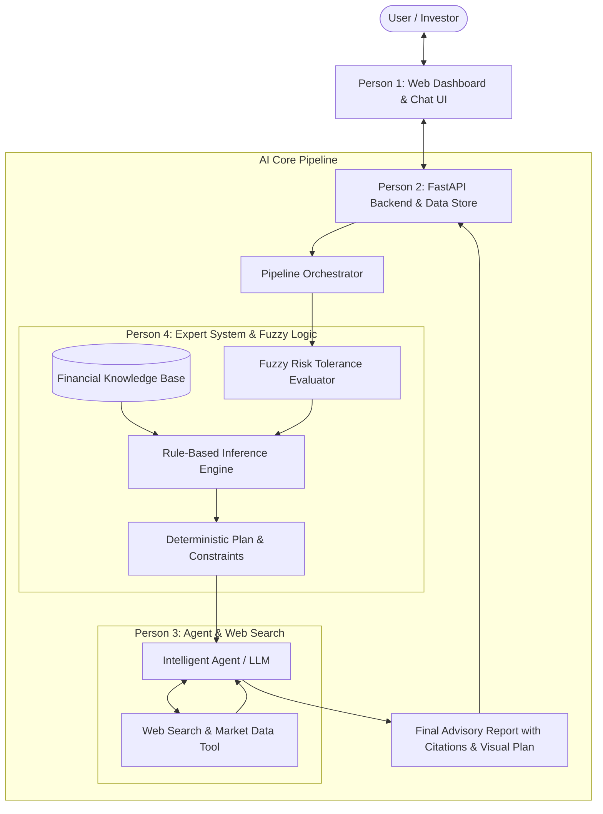

# 📈 FinWise AI: Hybrid Intelligent Financial Advisory System

> An academically grounded, production-ready AI Financial Advisor combining **Large Language Models (Conversational AI & Web Search)** with a **Rule-Based Expert System & Fuzzy Risk Engine** designed specifically for university AI curriculum requirements.

---

## 🌟 Quick Overview

Most student projects using LLMs are dismissed by evaluators as *"just an API wrapper around OpenAI/Gemini with web search"*. 

**FinWise AI** solves this problem by implementing a **Hybrid AI Architecture**:
1. **Intelligent Agent Core (LLM + Real-time Web Search)**: Handles natural conversational interaction, market news retrieval, and user intent parsing.
2. **Rule-Based Expert System (Inference Engine + Knowledge Base)**: Applies deterministic financial logic (50/30/20 budgeting, debt-to-income limits, emergency fund health checks, age-based asset allocations).
3. **Fuzzy Risk Assessment Engine**: Models real-world human uncertainty in investor risk appetite using fuzzy membership functions (Conservative, Moderate, Aggressive).

This gives your team of 4 a standout project that fulfills **both** cutting-edge modern AI (LLMs, RAG, Web Search) and **classical university syllabus AI** (Intelligent Agents, Expert Systems, Knowledge Representation, Fuzzy Logic, Search/Optimization).

---

## 👥 Team Work Division (4 Members)

| Member | Role | Primary Responsibilities | Deliverables |
| :--- | :--- | :--- | :--- |
| **Person 1** | **Frontend & UI/UX Specialist** | Interactive Dashboard, Chat UI, Risk Questionnaire, Visual Charts | Modern React / Vite or Clean Web UI with Chart.js, responsive layouts |
| **Person 2** | **Backend & Orchestrator Lead** | FastAPI server, session management, user profile database, API orchestration | REST APIs, database models (SQLite), unified pipeline orchestrator |
| **Person 3** | **LLM & Web Search Engine** | Agent reasoning loop, live search integration (DuckDuckGo/Tavily/yfinance), prompt synthesis | Search & market retrieval tools, LLM advisory pipeline with source citations |
| **Person 4** | **AI Expert System & Risk Engine** | Syllabus-based Expert System, Rule Base, Fuzzy Risk Evaluator, Safety Guardrails | Deterministic financial rule engine, fuzzy inference logic, compliance auditor |

👉 See [docs/WORK_DIVISION_4_PEOPLE.md](file:///c:/Users/anshu/OneDrive/Desktop/ai-project-financial-advisory-system/docs/WORK_DIVISION_4_PEOPLE.md) for full parallel task matrices, timelines, and Git workflows.

---

## 📚 Project Documentation Directory

- 📄 **[Project Specification](file:///c:/Users/anshu/OneDrive/Desktop/ai-project-financial-advisory-system/docs/PROJECT_SPECIFICATION.md)**: Full architecture, mathematical formulas, feature lists, and design principles.
- 🎓 **[Syllabus Mapping Guide](file:///c:/Users/anshu/OneDrive/Desktop/ai-project-financial-advisory-system/docs/SYLLABUS_MAPPING.md)**: Detailed cheat sheet mapping project modules directly to your AI syllabus (perfect for reports and viva defense).
- 🤝 **[Parallel Work Division](file:///c:/Users/anshu/OneDrive/Desktop/ai-project-financial-advisory-system/docs/WORK_DIVISION_4_PEOPLE.md)**: Day-by-day tasks and independent milestones for each team member.
- 🔌 **[API Contracts & Schemas](file:///c:/Users/anshu/OneDrive/Desktop/ai-project-financial-advisory-system/docs/API_CONTRACTS.md)**: Mock JSON contracts so all 4 team members can develop independently without blocking each other.

---

## 🏛️ High-Level System Architecture

---

## 🚀 Setup & Execution (Once Development Starts)

*Note: Code implementation begins after team review and approval of the documentation.*
