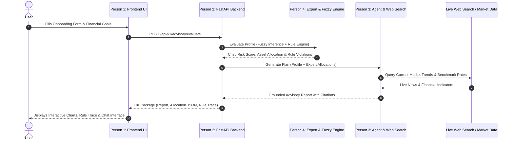

# 📋 Project Specification: FinWise AI Financial Advisory System

## 1. Executive Summary & Problem Statement

### 1.1 The Problem with Simple LLMs in Finance
Many AI student projects attempt financial advisory simply by passing user prompts directly into a generative LLM (ChatGPT / Gemini) with web search. While natural and fluent, this pure-LLM approach suffers from critical flaws:
- **Hallucinations & Mathematical Inaccuracy**: LLMs struggle with deterministic arithmetic, compounding interest schedules, and strict budget balance constraints.
- **Lack of Explainability ("Black Box")**: When a professor asks *"Why did your system recommend 65% equity and not 40%?"*, an LLM cannot trace back to formal financial axioms or rule sets.
- **Absence of Core AI Curriculum Concepts**: Evaluators quickly grade down generic API wrappers because they fail to showcase foundational AI topics taught in the course (Search, Knowledge Representation, Expert Systems, Fuzzy Logic).

### 1.2 The Solution: Hybrid AI Architecture
**FinWise AI** combines modern generative intelligence with classical rule-based AI:
1. **Intelligent Agent (Modern AI)**: Evaluates user intent, coordinates tools, queries the live web for current market trends, and articulates tailored explanations.
2. **Rule-Based Expert System (Classical AI)**: Implements production rules ($IF \dots THEN \dots$) for emergency funds, 50/30/20 budget allocations, debt-to-income caps, and regulatory disclaimers.
3. **Fuzzy Risk Evaluation Engine (Soft Computing)**: Replaces arbitrary binary risk scores with continuous fuzzy membership functions (Age, Horizon, Volatility Tolerance $\rightarrow$ Fuzzy Risk Score).

---

## 2. Core Functional Requirements

### Feature 1: User Profile & Financial Onboarding
- Collection of financial telemetry:
  - Age & Employment status
  - Monthly net income & fixed monthly expenses
  - Existing debt & interest rates
  - Liquid savings / Emergency fund balance
  - Primary investment goals (e.g., Retirement, Buying a Home, Wealth Accumulation)
  - Time horizon (Short: < 3 yrs, Mid: 3–7 yrs, Long: > 7 yrs)

### Feature 2: Fuzzy Risk Tolerance Evaluator
- Converts crisp user inputs into fuzzy linguistic variables:
  - *Age*: Young, Middle-Aged, Senior
  - *Investment Horizon*: Short-term, Medium-term, Long-term
  - *Loss Tolerance*: Low, Medium, High
- Uses Mamdani fuzzy inference rules to output a calibrated **Risk Profile** (Conservative, Balanced, Growth, Aggressive).

### Feature 3: Rule-Based Expert System (Financial Health & Allocation)
- **Knowledge Base (Rules)**:
  - `RULE_EMERGENCY_FUND`: If liquid savings < 3x monthly expenses $\rightarrow$ prioritize emergency liquidity before equity allocation.
  - `RULE_HIGH_INTEREST_DEBT`: If debt interest rate > 8% $\rightarrow$ recommend debt repayment before aggressive investing.
  - `RULE_BUDGET_50_30_20`: Verify needs ($\le 50\%$), wants ($\le 30\%$), and savings ($\ge 20\%$).
  - `RULE_ASSET_ALLOCATION`: Calculate equity vs. debt vs. gold/cash percentages grounded on the fuzzy risk tier and investor age ($100 - \text{Age}$ heuristic with risk adjustment).
- **Inference Engine**: Forward-chaining engine that outputs a deterministic, mathematically verifiable baseline asset allocation and flags financial vulnerabilities.
- **Explanation Facility**: Outputs exact reasons and fired rules explaining *why* every decision was made.

### Feature 4: Intelligent Agent with Web Search (Market Intelligence)
- Real-time market context provider:
  - Live interest rates, inflation indicators, index fund performance (S&P 500 / Nifty 50 / NASDAQ), and current economic outlook.
  - DuckDuckGo / Tavily web search integration.
- The LLM receives the **Deterministic Financial Plan** from the Expert System + **Live Market Search Data** and generates an easy-to-understand, personalized advisory report with citations.

### Feature 5: Interactive Web Dashboard & Chat Assistant
- Visual charts: Asset allocation pie charts, budget breakdown bar charts, net worth projection line graphs.
- Conversational assistant with follow-up Q&A capability (grounded in the user's specific financial plan).
- One-click PDF / Markdown financial summary export.

---

## 3. System Architecture Diagram

---

## 4. Recommended Technology Stack

| Component | Technology | Rationale |
| :--- | :--- | :--- |
| **Frontend** | React (Vite) or Vanilla HTML/CSS/JS + Tailwind CSS + Chart.js | Lightning-fast, rich interactive visual charts, zero bloated configuration |
| **Backend** | Python 3.10+ with FastAPI & Uvicorn | Native async, high performance, automatic OpenAPI documentation, clean JSON serialization |
| **LLM Provider** | OpenRouter API (`https://openrouter.ai/api/v1`) | Access to DeepSeek V3, Llama 3.3, Claude 3.5, and Gemini models via single OpenAI-compatible key |
| **Agent Framework** | PydanticAI (or Smolagents) | Lightweight, non-LangChain framework with native typing, dependency injection, and clean tool execution |
| **Live Web Search** | DuckDuckGo Search API / Tavily / yfinance | Free, requires no complicated paid credit cards, returns real-time market data |
| **Expert System** | Native Python Forward-Chaining Engine | Transparent, easily debugged, 100% explainable to college professors |
| **Fuzzy Logic** | Native Python Fuzzy Module (Triangular/Trapezoidal functions) | Clean mathematical implementation directly demonstrating course concepts |

---

## 5. Security, Ethics & Academic Guardrails

1. **Non-Custodial Disclaimer**: System explicitly tags all outputs with regulatory disclaimers: *"For informational and educational purposes only. FinWise AI is not a SEBI/SEC licensed financial advisor."*
2. **Deterministic Arithmetic**: The LLM is **never** allowed to calculate compounding interest or budget math directly; it only reads and presents verified calculations computed by the Expert System.
3. **No Hallucination Fallback**: If web search queries fail or return contradictory results, the agent falls back safely to historical benchmarks.
