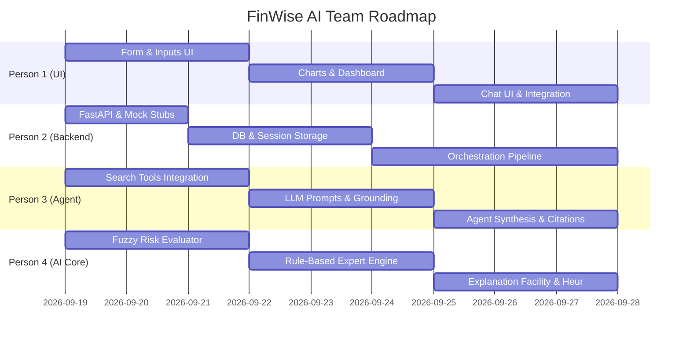

# 👥 Parallel Work Division Plan for Team of 4

To ensure that all 4 team members can work **concurrently without blocking one another or having Git merge conflicts**, the project is partitioned into 4 decoupled subsystems connected through strictly defined [API Contracts](file:///c:/Users/anshu/OneDrive/Desktop/ai-project-financial-advisory-system/docs/API_CONTRACTS.md).

---

## 🧭 Team Responsibility Matrix

```
┌────────────────────────────────────────────────────────────────────────┐
│                          FINWISE AI SYSTEM                             │
├──────────────────┬──────────────────┬──────────────────┬───────────────┤
│  PERSON 1 (UI)   │ PERSON 2 (BACK)  │ PERSON 3 (AGENT) │ PERSON 4 (ES) │
│  Frontend & UX   │ API Orchestrator │ LLM & Web Search │ Expert & Fuzzy│
├──────────────────┼──────────────────┼──────────────────┼───────────────┤
│ • Onboarding UI  │ • FastAPI Server │ • Agent Loop     │ • Rule Engine │
│ • Allocation Pie │ • Session State  │ • Search Provider│ • Knowledge   │
│ • Chat Assistant │ • DB & History   │ • Prompt System  │   Base Rules  │
│ • Rule Trace View│ • API Endpoints  │ • Live Retrieval │ • Fuzzy Logic │
│ • Plan Export    │ • Mock Provider  │ • LLM Grounding  │ • Heuristic   │
│                  │                  │                  │   Goal Search │
└──────────────────┴──────────────────┴──────────────────┴───────────────┘
```

---

## 👤 Person 1: Frontend & UI/UX Specialist

### Role Summary
Owns the entire client-facing web application, ensuring a responsive, visual, and intuitive financial dashboard with modern aesthetics.

### Assigned Files / Modules
- `frontend/`
  - `index.html` (Semantic HTML5 layout, meta tags, Google Fonts)
  - `css/styles.css` (Tailwind / Custom CSS with modern dark/light styling, glassmorphism)
  - `js/api.js` (Fetch calls to Person 2's FastAPI endpoints)
  - `js/charts.js` (Chart.js / ApexCharts for asset allocation pie chart, budget bar chart)
  - `js/chat.js` (Streaming or asynchronous financial chat UI with citation bubbles)
  - `js/onboarding.js` (Multi-step form for income, expenses, debts, goals, risk tolerance)

### Independent Working Mode (How to work before backend is ready)
- Uses the [API Contracts](file:///c:/Users/anshu/OneDrive/Desktop/ai-project-financial-advisory-system/docs/API_CONTRACTS.md) with local mock JSON files or a mock API flag in `api.js`.
- Can design and completely polish the dashboard, charts, forms, and chat bubbles without waiting for backend or AI code.

### Milestones & Deliverables
1. **Milestone 1**: Build the multi-step financial onboarding questionnaire (inputs for income, savings, debt, time horizon, risk questions).
2. **Milestone 2**: Build the Financial Dashboard displaying:
   - Interactive Asset Allocation Doughnut Chart (Equity, Debt, Cash, Gold).
   - 50/30/20 Budget Breakdown Bar Chart.
   - Expert System Explanation Card (showing list of rules that fired).
3. **Milestone 3**: Build the conversational chat box supporting markdown responses and clickable source citations.
4. **Milestone 4**: Export to PDF / Print summary button for the user's financial plan.

---

## 👤 Person 2: Core Backend & API Orchestrator Lead

### Role Summary
Builds the server infrastructure, coordinates requests between the Frontend, the Expert System (Person 4), and the LLM Agent (Person 3), and manages data persistence.

### Assigned Files / Modules
- `backend/`
  - `main.py` (FastAPI app entry point, CORS configuration, health checks)
  - `routers/advisory.py` (Endpoint for `/evaluate`, `/chat`, `/history`)
  - `services/orchestrator.py` (Coordinates Person 4's engine and Person 3's agent)
  - `models/database.py` (SQLite setup via SQLAlchemy or simple JSON store)
  - `schemas.py` (Pydantic request/response models matching API Contracts)
  - `requirements.txt` (Server dependencies: fastapi, uvicorn, pydantic, etc.)

### Independent Working Mode
- Starts by writing the Pydantic schemas in `schemas.py` from the contract.
- Provides mock stub responses for `/api/v1/advisory/evaluate` and `/api/v1/advisory/chat` so Person 1 can connect immediately.
- Once Person 3 and Person 4 finish their Python modules, Person 2 imports and connects them in `services/orchestrator.py`.

### Milestones & Deliverables
1. **Milestone 1**: Set up FastAPI boilerplate, CORS, and Pydantic validation schemas.
2. **Milestone 2**: Implement mock endpoints and SQLite storage for session profiles and chat history.
3. **Milestone 3**: Integrate Person 4's `ExpertSystem` & `FuzzyEngine` into the evaluation pipeline.
4. **Milestone 4**: Integrate Person 3's `FinancialAgent` into the synthesis & chat pipeline with error handling.

---

## 👤 Person 3: LLM & Web Search Intelligent Agent

### Role Summary
Builds the Intelligent Agent module (Perception-Reasoning-Action), integrating LLM API calls with real-time web search for financial news and market benchmarks.

### Assigned Files / Modules
- `backend/agent/`
  - `financial_agent.py` (Agent loop: built with PydanticAI / lightweight tool-calling agent)
  - `search_tools.py` (DuckDuckGo search / financial market data tool wrapper)
  - `prompt_templates.py` (System prompts, persona definition, citation instructions)
  - `openrouter_client.py` (OpenRouter API client supporting models like Llama 3.3, DeepSeek, Claude, Gemini)
  - `test_agent_standalone.py` (Local CLI test script to verify agent search + prompt)

### Independent Working Mode
- Works entirely inside `backend/agent/`.
- Can test the LLM and search capabilities from `test_agent_standalone.py` using dummy financial profiles.
- Does not need the frontend or database running to develop and optimize prompts.

### Milestones & Deliverables
1. **Milestone 1**: Set up `openrouter_client.py` using OpenRouter's OpenAI-compatible endpoint (`https://openrouter.ai/api/v1`) with configurable model selection.
2. **Milestone 2**: Build `search_tools.py` using `duckduckgo-search` to fetch live inflation, interest rates, and market index trends.
3. **Milestone 3**: Implement the agent using a modern non-LangChain framework (e.g. **PydanticAI** or **Smolagents**) that consumes Person 4's expert system allocation numbers.
4. **Milestone 4**: Implement the conversational follow-up handler for interactive user questions with source citations.

---

## 👤 Person 4: AI Expert System & Fuzzy Risk Engine (Syllabus Core)

### Role Summary
Builds the academic core of the project: the rule-based forward-chaining expert system, financial knowledge base, explanation facility, and fuzzy logic risk assessor.

### Assigned Files / Modules
- `backend/expert_system/`
  - `rules.py` (Financial production rules: emergency fund, 50-30-20, debt payoff, asset allocation)
  - `engine.py` (Forward-chaining inference engine + working memory)
  - `explanation.py` (Explanation facility generating human-readable rule audit trail)
  - `goal_search.py` (Heuristic goal optimizer: budget allocation search across competing goals)
- `backend/fuzzy_logic/`
  - `membership.py` (Triangular/Trapezoidal membership functions for Age, Horizon, Risk)
  - `risk_evaluator.py` (Mamdani fuzzy inference engine mapping inputs $\rightarrow$ crisp risk score)
  - `test_expert_standalone.py` (Local CLI test script to verify rules and fuzzy scoring)

### Independent Working Mode
- Pure Python logic with zero external web or UI dependencies.
- Can run and test all mathematical rules and fuzzy functions from `test_expert_standalone.py`.
- Ships clean, deterministic Python functions with typed signatures ready for Person 2 to plug into the orchestrator.

### Milestones & Deliverables
1. **Milestone 1**: Implement fuzzy membership functions and the Mamdani risk evaluation system in `fuzzy_logic/`.
2. **Milestone 2**: Implement the Knowledge Base (`rules.py`) with at least 8–10 sound financial axioms.
3. **Milestone 3**: Build the Forward-Chaining Inference Engine (`engine.py`) and Explanation Facility (`explanation.py`).
4. **Milestone 4**: Implement the heuristic budget goal search and write comprehensive unit tests.

---

## 🗓️ 4-Phase Project Execution Roadmap



### Phase 1: Contracts & Stubs (Days 1–2)
- Person 2 commits initial directory layout, `requirements.txt`, and API models.
- Person 2 spins up mock endpoints.
- All 4 members pull the repository and verify their local environment.

### Phase 2: Independent Subsystem Development (Days 3–6)
- Person 1 builds UI using mock JSON.
- Person 2 sets up database and session management.
- Person 3 refines search tools and LLM prompt grounding.
- Person 4 validates all fuzzy rules and expert system logic with unit tests.

### Phase 3: Integration & End-to-End Wiring (Days 7–9)
- Person 2 connects Person 4 (Expert System) $\rightarrow$ Person 3 (Agent) in `orchestrator.py`.
- Person 1 connects frontend `fetch()` to real backend endpoints.
- End-to-end testing with sample investor personas (e.g., student with loans vs. 40-year-old with savings).

### Phase 4: Polish, Viva Prep & Report (Days 10–12)
- Test edge cases and ensure safety disclaimers.
- Prepare presentation slides using [Syllabus Mapping](file:///c:/Users/anshu/OneDrive/Desktop/ai-project-financial-advisory-system/docs/SYLLABUS_MAPPING.md).
- Practice the viva defense questions.
